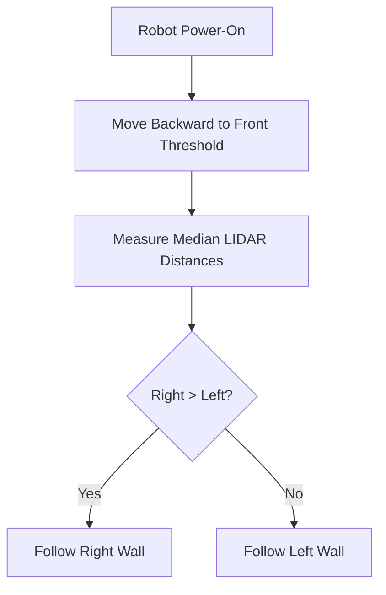
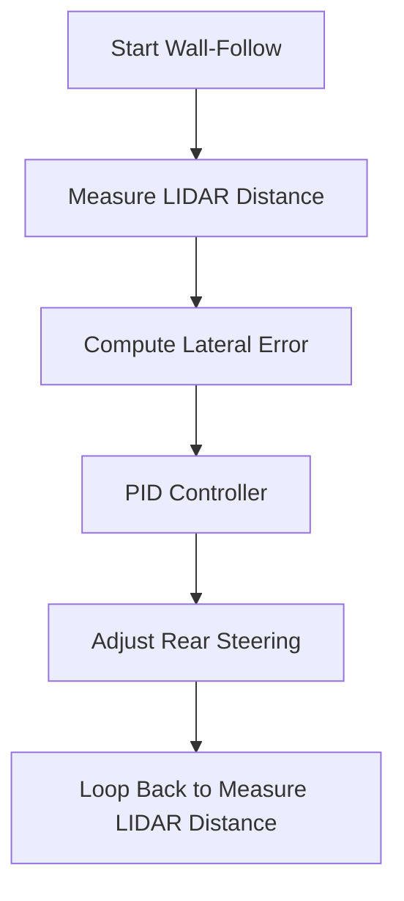
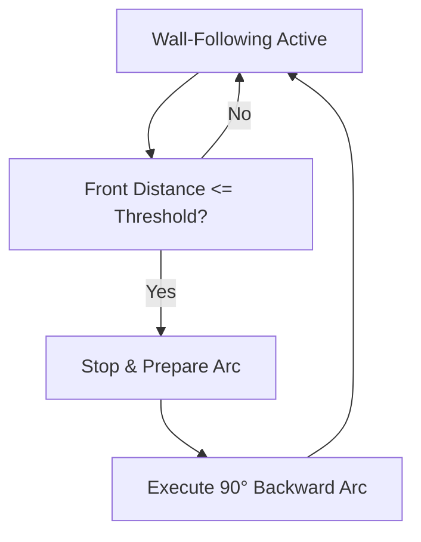
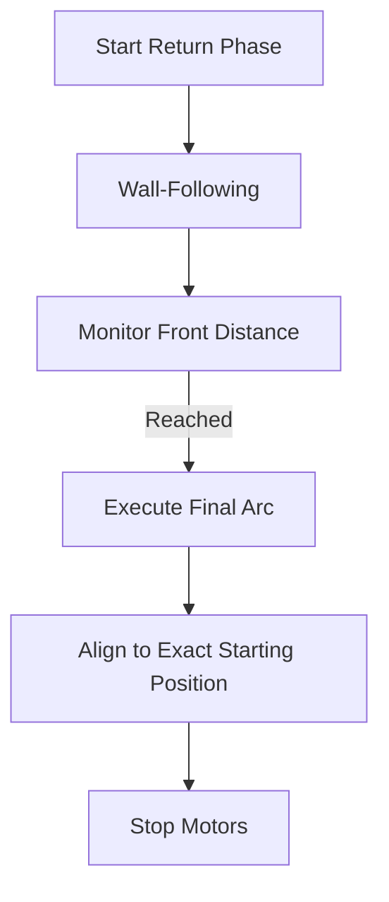
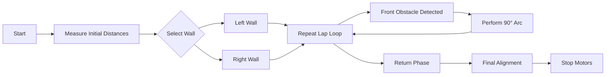
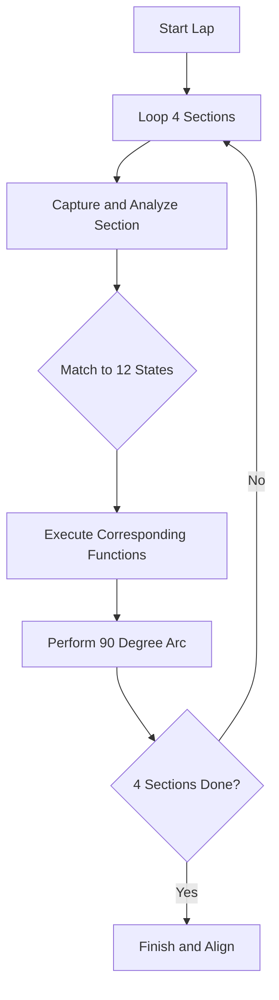
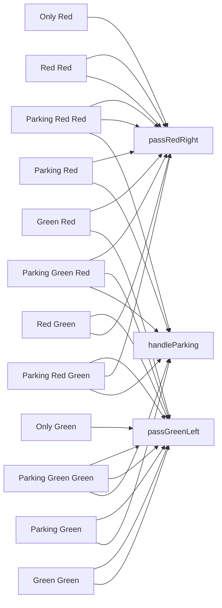
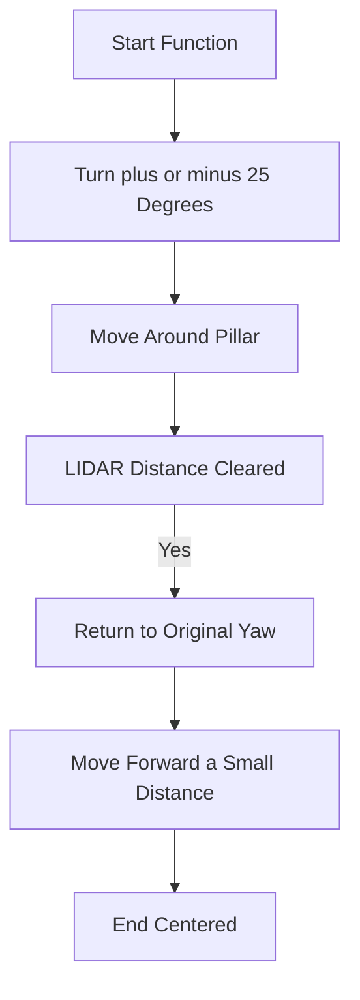
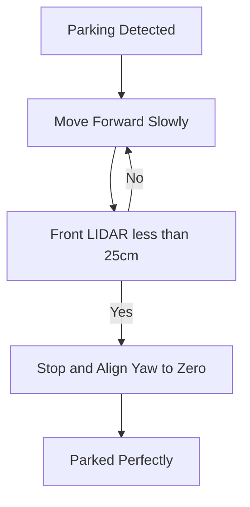
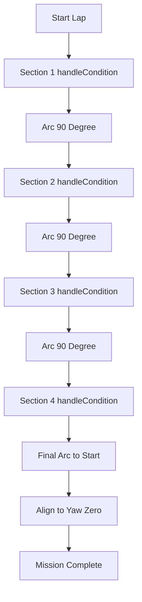

# 🏁 Open Challenge – Strategy Overview

This document outlines the **strategy** for the Raspberry Pi-controlled wall-following robot in the WRO Future Engineers 2025 Open Challenge.  
It focuses on **high-level decision-making, navigation logic, and visualizations**, without reference to code.

---

## 🎯 Mission Goals

- Complete **3 laps** along the designated wall path.  
- Maintain **precise lateral distance** from the chosen wall.  
- Execute **accurate 90° arcs** when turning corners.  
- Detect front obstacles and **stop safely**.  
- Return to the **exact starting position** after completing laps.  

**Constraints**:  

- Robot starts facing a wall.  
- No prior map; decisions are based **on-the-fly sensor data**.  
- Sensors: **LIDAR** (distance & angle), **IMU** (yaw, pitch, roll), optional encoders.  
- Actuators: **Rear Ackermann steering**, motors controlled via I²C.

---

## 🧭 Step 1 – Startup and Initial Assessment

1. **Move backward slowly** until the front distance is below a threshold.  
2. **Measure median distances** to the left, right, and front sectors using LIDAR:  
   - Right: 10°–50°  
   - Left: 130°–170°  
   - Front: 80°–100°  
3. **Decide wall side**:  
   - Follow the wall with the **larger median distance**, ensuring easier navigation.  

**Visual representation**:

---

## 🧭 Step 2 – Wall-Following PID Loop

**Objective:** Maintain a constant lateral distance to the chosen wall.

**Sensors:** LIDAR sector (right or left), IMU yaw for stability.

**Control Logic:**

- Compute distance error: 

   $error = target\_distance - measured\_distance$

- Apply PID correction to rear steering.  

**Key Points:**

- Use median filtering to reject spurious LIDAR readings.  
- Maintain relative yaw stability to avoid drift during long straight segments.  

**Visualization:**

---

## 🧭 Step 3 – Obstacle Detection & Lap Completion

**Detection:** Front LIDAR distance falls below a threshold consistently for several consecutive readings.

**Action:** Stop wall-following and execute a 90° backward arc using IMU feedback.

**Lap Loop:**

- Repeat wall-following until obstacle detected.  
- Execute arc turn.  
- Continue to next segment.

**Flowchart:**

---

## 🧭 Step 4 – Return to Starting Position

**Objective:** After completing all laps, return to the starting front distance.

**Strategy:**

- Resume wall-following on previously chosen wall.  
- Monitor front LIDAR distance to match starting threshold.  
- Execute final alignment arcs if necessary.

**Flowchart:**

---

## 🔑 Key Strategy Principles

- **Adaptive Wall Selection:** Robot evaluates left/right median distance to choose wall dynamically.  
- **Robust PID Wall-Following:** Smooth steering corrections based on median LIDAR distance and IMU yaw. Handles sensor noise and avoids oscillations.  
- **Threaded Sensor Monitoring:** LIDAR, IMU, and front-distance checks run asynchronously to wall-following.  
- **Arc Turns Using IMU:** 90° backward turns rely on yaw feedback for accuracy. Steering angle scaled to prevent overshoot.  
- **Front Distance Filtering:** Requires multiple consecutive measurements to confirm obstacles, avoiding false stops.  
- **Return Path Symmetry:** Final return uses same wall-following logic and thresholds to ensure precise alignment.

---

## 🖼️ Visualization Summary

---

## 🧩 Optional Visual Enhancements

- Include median distance graphs per lap for front/left/right LIDAR sectors.  
- Yaw vs. time plot to visualize arc completion.  
- Steering angle vs. error to illustrate PID correction.

---

✅ **Summary**

The Open Challenge strategy is built on:

- Adaptive, real-time wall selection  
- Robust PID wall-following  
- IMU-assisted arc turns  
- Threaded monitoring for obstacle detection  
- Precision return to starting position

# 🚧 Obstacle Challenge – Flowcharts Overview

## 🧭 Main Section Loop

---

## 🧩 12 Possible States
## 🧩 12 Possible States

## 🔴 passRedRight / 🟢 passGreenLeft Flow

---

## 🅿️ handleParking Flow

## 🧭 Full Lap Logic

