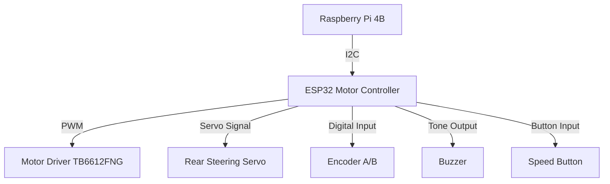
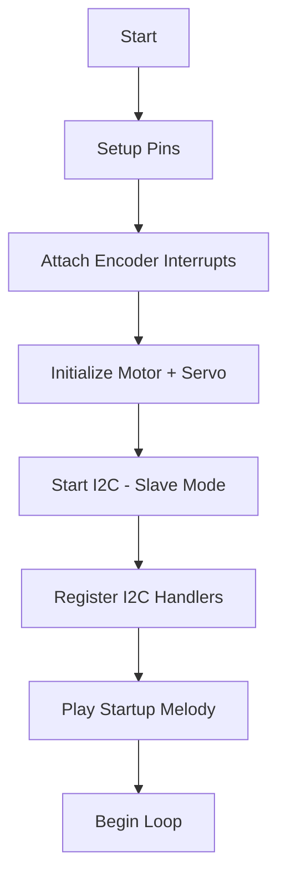

# ⚙️ ESP32 Motor + Servo + I²C Control Module  
### for WRO Future Engineers 2025 – Mindcraft Team

> NOTE: This README contains the original project documentation (overview, pinout, protocol, etc.) plus a detailed, line-by-line explanation of the two items you asked for:
> - PlatformIO project configuration (platformio.ini)
> - The firmware file `src/main.cpp`
>
> The explanations include tips, warnings, and concrete recommended fixes where the code has contradictions or likely bugs. All original content is kept and arranged with the additional explanatory sections appended and clearly labeled.

---

## 📌 Table of Contents — ESP32 Motor Module

> [!TIP]
> Click the arrow below 👇 to expand the **Table of Contents**.  
> Every item is a clickable link to a section in this README.

<details>
<summary><b>📂 Table of Contents</b></summary>

1. [1. 🧠 Overview](#1-🧠-overview)
   - [1.1 Responsibilities](#11-responsibilities)
2. [2. 🧩 System Diagram](#2-🧩-system-diagram)
3. [3. 🧱 Hardware Pinout (GPIO Pins)](#3-🧱-hardware-pinout-gpio-pins)
4. [4. 🔄 Communication Protocol](#4-🔄-communication-protocol)
   - [4.1 Commands from Raspberry Pi → ESP32](#41-commands-from-raspberry-pi-→-esp32)
   - [4.2 Response ESP32 → Raspberry Pi](#42-response-esp32-→-raspberry-pi)
5. [5. ⚙️ Motor Control](#5-⚙️-motor-control)
   - [5.1 Motor Driver Configuration](#51-motor-driver-configuration)
   - [5.2 Direction Logic](#52-direction-logic)
   - [5.3 PWM Speed Calculation](#53-pwm-speed-calculation)
6. [6. 🧮 Encoder-Based Distance Calculation](#6-🧮-encoder-based-distance-calculation)
   - [6.1 Parameters](#61-parameters)
   - [6.2 Direction Detection (Quadrature Encoding)](#62-direction-detection-quadrature-encoding)
7. [7. 🧭 Servo Steering System](#7-🧭-servo-steering-system)
   - [7.1 Servo Calibration](#71-servo-calibration)
   - [7.2 Percent-to-Angle Mapping](#72-percent-to-angle-mapping)
8. [8. 🔊 Buzzer Feedback System](#8-🔊-buzzer-feedback-system)
9. [9. 🔘 Button Input](#9-🔘-button-input)
10. [10. ⚡ Quick Start](#10-⚡-quick-start)
11. [11. ⚙️ Servo Configuration (in `src/main.cpp`)](#11-⚙️-servo-configuration-in-srcmaincpp)
12. [12. 🔌 I²C Communication Example](#12-🔌-i²c-communication-example)
13. [13. 🧪 Testing Routines](#13-🧪-testing-routines)
14. [14. 🧰 Initialization Flow](#14-🧰-initialization-flow)
15. [15. 🪫 Power Management](#15-🪫-power-management)
16. [16. 📟 Serial Output Example](#16-📟-serial-output-example)
17. [17. 🧩 Summary](#17-🧩-summary)
18. [18. 🧾 PlatformIO Project Configuration Explained (platformio.ini)](#18-🧾-platformio-project-configuration-explained-platformioini)
19. [19. 🛠 Firmware Walkthrough — `src/main.cpp` (line-by-line explanation and notes)](#19-🛠-firmware-walkthrough--srcmaincpp-line-by-line-explanation-and-notes)

</details>

---

## 1. 🧠 Overview

### 1.1 Responsibilities
- Control **motor speed and direction** via PWM and H-bridge.
- Handle **servo steering** (rear steering mechanism).
- Measure **distance traveled** using an **incremental encoder**.
- Communicate over **I²C** with the Raspberry Pi.
- Provide **audible feedback** via a buzzer.
- Allow **manual control** with an onboard button for testing.

---

## 2. 🧩 System Diagram



---

## 3. 🧱 Hardware Pinout (GPIO Pins)

| Component / Function          | GPIO Pin |
|------------------------------|----------|
| PWB (Motor or Power Switch)  | 14       |
| BI2 (Motor Input 2)          | 12       |
| BI1 (Motor Input 1)          | 26       |
| STBY (Motor Driver Standby)  | 25       |
| SERVO PWM Signal             | 27       |
| ENCODER B Phase              | 32       |
| ENCODER A Phase              | 33       |
| PUSH BUTTON                  | 19       |
| BUZZER                       | 4        |

TIP: Use consistent pin naming in both code and wiring diagrams. Double-check wiring before powering motors.

---

## 4. 🔄 Communication Protocol

The ESP32 acts as an I²C slave device with address 0x08.

### 4.1 Commands from Raspberry Pi → ESP32

| Command           | Description                                   | Example          |
|-------------------|-----------------------------------------------|------------------|
| M_SPEED:<value>   | Set motor speed. Positive = forward, Negative = backward | M_SPEED:80 or M_SPEED:-100 |
| M_STOP            | Immediately stop motor                         | M_STOP           |
| SERVO_ANG:<angle> | Set steering servo to a given angle (0–180°) | SERVO_ANG:105    |

### 4.2 Response ESP32 → Raspberry Pi

| Response         | Description                    |
|------------------|--------------------------------|
| <encoderCount>   | Returns current encoder count (as string) |

WARNING: Wire.write() sends raw bytes. If the master expects a fixed-length binary value you must change format. Current implementation returns ASCII string of encoderCount.

---

## 5. ⚙️ Motor Control

### 5.1 Motor Driver Configuration

The TB6612FNG driver is controlled with:

- PWM on PIN_PWB (channel 1 or 0 depending on code block — see firmware notes)
- Direction pins: PIN_BI1 and PIN_BI2
- Standby pin: PIN_STBY

TIP: TB6612FNG requires appropriate motor supply voltage and a common ground between driver and ESP32.

### 5.2 Direction Logic

| BI1  | BI2  | Motion      |
|-------|-------|-------------|
| HIGH  | LOW   | Forward     |
| LOW   | HIGH  | Reverse     |
| LOW   | LOW   | Brake / Stop|

### 5.3 PWM Speed Calculation

The PWM duty cycle is set proportionally to the requested speed percentage:

Duty = speedPercent * (2^MOTOR_LEDC_RES - 1) / 100

For 8-bit resolution:

maxDuty = 2^8 - 1 = 255

Example:

speedPercent = 75; dutyCycle = (75 * 255) / 100 ≈ 191

TIP: Use ledcSetup and ledcAttachPin to map a channel to the motor PWM pin.

---

## 6. 🧮 Encoder-Based Distance Calculation

### 6.1 Parameters

| Parameter              | Symbol | Value              |
|-----------------------|--------|--------------------|
| Wheel diameter        | D      | 0.065 m (65 mm)    |
| Pulses per revolution | P      | 360                |
| Circumference         | C      | π D = 0.2042 m     |
| Pulses per meter      | P_m    | P / C ≈ 1763 pulses/m |

Pulses per millimeter:

pulsesPerMm = P / (C × 1000) = P / (π × D_mm)

To move 100 mm, motor must generate:

N = 100 × pulsesPerMm ≈ 553 pulses

WARNING: See firmware walkthrough — variable naming causes unit confusion. Ensure diameter is in same units as calculation.

### 6.2 Direction Detection (Quadrature Encoding)

In ISR:

if (a == b)
  encoderCount--;
else
  encoderCount++;

- Clockwise rotation → increment
- Counter-clockwise → decrement

TIP: Keep ISR short and very fast. Only update volatile counters and set flags; do heavy processing in loop().

---

## 7. 🧭 Servo Steering System

### 7.1 Servo Calibration

| Value  | Angle | Description        |
|--------|--------|---------------------|
| 35°    | Full left  | Physical limit left  |
| 145°   | Full right | Physical limit right |
| 90°    | Center     | Neutral position     |

### 7.2 Percent-to-Angle Mapping

From -100% (left) to +100% (right):

angle = SERVO_MIN + ((percent + 100) / 200) × (SERVO_MAX - SERVO_MIN)

Example for percent = 50:

angle = 35 + (150 / 200) × 110 = 117.5° ≈ 118°

TIP: Calibrate servoMin/servoMax to physical limits to avoid mechanical stress.

---

## 8. 🔊 Buzzer Feedback System

| Tone       | Frequency (Hz) | Duration (ms) | Use            |
|------------|----------------|---------------|----------------|
| TONE_START | 1000           | 120           | Movement start |
| TONE_END   | 1500           | 120           | Movement complete |
| TONE_ERR   | 2000           | 120           | Error signal   |

Startup and shutdown sequences use melodic tones.

TIP: Use low duty audio tones when running on limited power to avoid voltage sags.

---

## 9. 🔘 Button Input

Onboard button (PIN 19) adjusts speed for debugging. Each press increases speed by 25%, wrapping after 100%.

Debounce time: t_debounce = 50 ms

TIP: Use INPUT_PULLUP and wire button to ground (active-low) as in firmware.

---

## 10. ⚡ Quick Start

- Build with PlatformIO (in VS Code): click **PlatformIO Build** or run

```bash
platformio run
```

from the project root.

- Upload to a connected board: use **PlatformIO Upload** or run

```bash
platformio run --target upload
```

- Open serial monitor at 115200 to view logs.

TIP: Use platformio.ini monitor_speed to match Serial baud.

---

## 11. ⚙️ Servo Configuration (in `src/main.cpp`)

- `servoMin`, `servoMax` — safe angular range for the servo (defaults: 35..145).
- `servoMid` — computed center position.
- `servoStep`, `checkDelayMs` — control sweep resolution and speed (tune for smoothness).

Call steer(<percent>) to move servo with percent mapping.

---

## 12. 🔌 I²C Communication Example

Raspberry Pi sends:

M_SPEED:-80

ESP32 executes:
- Sets motor direction to reverse.
- Converts -80 to speedPercent = 80.
- Calculates PWM duty cycle → ~204/255.
- Updates motor output.
- Logs via serial:

Motor direction: Reverse, speedPercent=80

WARNING: I²C buffer handling uses String and newline-terminated messages; ensure the master sends \n or \r.

---

## 13. 🧪 Testing Routines

| Function          | Description                            |
|-------------------|--------------------------------------|
| playStartupTone() | Plays startup melody                  |
| playPoweroffTone()| Plays shutdown melody                 |
| playErrorTone()   | Emits low-warning sound               |
| steer(percent)    | Converts steering percentage to servo angle |
| motorStop()       | Cuts motor PWM and disables standby  |
| handleButton()    | Adjusts speedPercent cyclically on button press |

---

## 14. 🧰 Initialization Flow



---

## 15. 🪫 Power Management

motorStandby(false) is used to fully disable the driver. Servo and buzzer consume power only during motion or tone playback. Idle loop checks every 1 second for encoder updates to reduce overhead.

TIP: Disable motor driver during long idle times. Ensure servo power is stable — a weak supply can reset the ESP32.

---

## 16. 📟 Serial Output Example

```
Setup complete
pulsesPerMm=5.528425
Initial speedPercent=50
Servo initialized at 90° (min=35, max=145)
Ready. Use moveDistanceMm(mm) to move and steeringServo.write(angle) to steer.

Motor direction: Forward, speedPercent=75
Encoder=135
Encoder=540
Motor stopped
Buzzer tone stop
```

---

## 17. 🧩 Summary

- Motor direction & speed via PWM
- Rear steering with percent-based mapping
- I²C slave communication with Raspberry Pi
- Encoder feedback for odometry
- Buzzer tones for events
- Manual speed testing button
- Modular code for easy integration

---

## 18. 🧾 PlatformIO Project Configuration Explained (platformio.ini)

Below is the project configuration you provided. Explanation follows.

```ini
; PlatformIO Project Configuration File
;
;   Build options: build flags, source filter
;   Upload options: custom upload port, speed and extra flags
;   Library options: dependencies, extra library storages
;   Advanced options: extra scripting
;
; Please visit documentation for the other options and examples
; https://docs.platformio.org/page/projectconf.html

[env:esp32dev]
platform = espressif32
board = esp32dev
framework = arduino

lib_deps = 
    madhephaestus/ESP32Servo@^3.0.8
    adafruit/Adafruit BMP280 Library@^2.6.8
    adafruit/Adafruit BNO055@^1.6.4

monitor_speed = 115200
```

Explanation — field-by-field:

- [env:esp32dev]
  - This is the environment name. platformio uses it to choose toolchain settings. The name "esp32dev" is conventional; you can add more environments for different boards.

- platform = espressif32
  - Tells PlatformIO which platform to use (Espressif IoT Development Framework support, toolchain, etc).

- board = esp32dev
  - The board ID. "esp32dev" selects a generic ESP32 Dev Module. If you have a different board (e.g., lolin32, esp32doit-devkit-v1), change it.

- framework = arduino
  - Uses the Arduino core for ESP32.

- lib_deps
  - Lists libraries that PlatformIO will fetch when building:
    - madhephaestus/ESP32Servo@^3.0.8 — servo helper for ESP32.
    - adafruit/Adafruit BMP280 Library — BMP280 pressure/temp sensor (unused in the shown firmware but included if you plan to add sensors).
    - adafruit/Adafruit BNO055 — IMU (also included for future usage).
  - TIP: Only list libraries you actually use. Unused libraries increase build time and binary size.

- monitor_speed = 115200
  - Sets default Serial Monitor baud rate to 115200. This should match Serial.begin(115200) in your code.

Tips and warnings for platformio.ini:
- If your board has limited flash, check the compiled firmware size after adding libraries.
- If you need OTA or special upload ports, add upload_port, upload_speed fields.
- For multiple boards, add multiple [env:...] sections.
- Always pin library versions for reproducible builds (you already use version constraints).

---

## 19. 🛠 Firmware Walkthrough — `src/main.cpp` (line-by-line explanation and notes)

Below is a structured walkthrough of the main firmware components you provided. I explain variables, pins, functions, data flow, and also call out inconsistencies and recommended fixes.

> TIP: Keep this file under version control and add COMMENTS in the code for future maintainers. The explanations below map directly to the parts of your code.

### 19.1 Top headers and globals

Code (excerpted and described):

- #include <Arduino.h>
- #include <ESP32Servo.h>          // Servo helper lib
- #include <math.h>
- #include <Wire.h>               // I2C library

I2C address:
- #define I2C_ADDRESS 0x08
  - The ESP32 plays the I2C slave at address 0x08. The Pi must use this address to communicate.

i2cBuffer:
- String i2cBuffer = "";
  - Buffer used to accumulate incoming I2C characters until newline. Using Arduino String is convenient but can fragment heap on long-running systems — consider fixed char buffer for production.

Pins and constants (purpose one-by-one):
- PIN_PWB (14): PWM pin for motor (PWB). This is the signal that controls motor driver PWM input.
- PIN_BI2 (12): Motor input 2 for direction.
- PIN_BI1 (26): Motor input 1 for direction.
- PIN_STBY (25): Standby pin — enable/disable motor driver (TB6612 STBY).
- PIN_SERVO (27): Servo control PWM output.
- PIN_ENC_B (32): Encoder channel B input.
- PIN_ENC_A (33): Encoder channel A input (interrupt attached).
- PIN_BUTTON (19): Onboard push button (active-low).
- PIN_BUZZER (4): Buzzer PWM output (tone generation).

Encoder / wheel constants:
- const float WHEEL_DIAMETER_MM = 0.065;
  - WARNING: This name implies units are millimetres but the value 0.065 is in METERS (i.e., 0.065 m = 65 mm). This will cause the pulses-per-mm calculation to be wrong. Recommended fix:
    - If you want diameter in millimeters: set WHEEL_DIAMETER_MM = 65.0;
    - If you want diameter in meters, rename to WHEEL_DIAMETER_M and keep value 0.065 and change downstream math accordingly.

- const int ENCODER_PULSES_PER_REV = 360;
  - Number of pulses per full revolution. Confirm your encoder datasheet (is 360 CPR or 90 pulses per channel × quadrature = 360?).

Derived:
- float pulsesPerMm;
  - computed in setup: pulsesPerMm = ENCODER_PULSES_PER_REV / (PI * WHEEL_DIAMETER_MM);
  - If WHEEL_DIAMETER_MM is mm, this formula is wrong — pulses per mm = P / (π × D_mm). If D_mm is mm (e.g., 65), then pulsesPerMm = P / (π * D_mm) — OK. If D is in meters, you'd get pulses per meter.

Volatile shared state (used by ISR and loop):
- volatile long encoderCount = 0;
- volatile int speedPercent = 50;
- const int SPEED_STEP = 25;
- unsigned long lastButtonMillis = 0;
- const unsigned long DEBOUNCE_MS = 50;

LEDC (ESP32 hardware PWM) constants:
- MOTOR_LEDC_FREQ = 2000, MOTOR_LEDC_RES = 8 — 2 kHz PWM, 8-bit resolution.
- BUZZER_LEDC_FREQ = 2000, BUZZER_LEDC_RES = 8

Tone constants:
- TONE_START, TONE_END, TONE_ERR, TONE_MS — used for buzzer sequences.

Servo globals:
- Servo steeringServo; // ESP32Servo variable
- const int SERVO_MIN = 35, SERVO_MAX = 145, SERVO_MID = (35+145)/2
- volatile bool encUpdated = false; // set by ISR when encoder changes

TIP: Keep volatile variables minimal and access them with brief critical sections.

---

### 19.2 Encoder ISR

Function:
- void IRAM_ATTR encoderISR()
  - Called on CHANGE of encoder pin A. Inside, it reads both A and B and increments/decrements encoderCount.
  - encUpdated flag set to true to indicate new data available for loop().

WARNING & TIP:
- ISR must be short and fast. Avoid Serial prints or heavy operations here — you're correctly only updating a volatile counter and a flag.
- Use "IRAM_ATTR" to keep ISR in IRAM (required if Flash may be inaccessible during interrupts).
- Consider using both-edge detection on one channel is common; ensure this ISR frequency is acceptable for your CPU load.

---

### 19.3 Motor helper functions (initMotor, direction, speed)

Functions summarized:

- initMotor()
  - Configures Bi-direction pins and standby, sets up a ledc channel, attaches PWM pin.
  - Sets standby LOW initially.

- motorStandby(bool on)
  - Drive STBY pin HIGH to enable driver; LOW to disable.

- setMotorDirectionForward(), setMotorDirectionReverse()
  - Sets BI1/BI2 to define motor polarity.

- setMotorSpeedPercent(int percent)
  - If percent <= 0 sets duty 0.
  - Clamps at 100.
  - Computes duty = (percent * maxDuty) / 100 with maxDuty = (1 << MOTOR_LEDC_RES) - 1
  - Calls ledcWrite(channel, duty).
  - Serial prints status.

- motorStop()
  - Calls setMotorSpeedPercent(0) and motorStandby(false).

INCONSISTENCY WARNING:
- Your file contains multiple definitions for MOTOR_LEDC_CHANNEL and MOTOR_LEDC_FREQ in different places (some sections use channel 0, some channel 1). Ensure you use only one ledc channel for the motor and attach pins only once. Duplicate setups can cause unpredictable behavior.

TIP:
- Choose one channel number (e.g., MOTOR_LEDC_CHANNEL = 0) and keep its setup centralized.

---

### 19.4 Buzzer / Tone helper

Function:
- void playTone(uint32_t freq, unsigned long ms)
  - Uses ledcWriteTone(PIN_BUZZER, freq);
  - WARNING: ledcWriteTone takes a PWM channel number, not a pin number. The code attaches the buzzer to a ledc channel earlier (BUZZER_CHANNEL = 1). When calling ledcWriteTone you must pass the BUZZER_CHANNEL constant (not PIN_BUZZER). Passing a pin can behave incorrectly.

Correct usage:
- ledcWriteTone(BUZZER_CHANNEL, freq);

TIP:
- If using ledcWriteTone make sure the channel supports hardware tones; an alternative is ledcWrite with a square wave or use tone() on supported boards.

---

### 19.5 Servo helpers

- initServo()
  - Attaches servo, sets to mid position, logs the initialization.

- setServo(int angle)
  - Clamps to min/max, writes angle if changed, logs.

- steer(int percent)
  - Clamps percent to [-100..100], maps to a float t and computes angle between servoMin and servoMax, then calls setServo(angle).

TIP:
- servo.attach(...) has min/max pulse width parameters in microseconds (e.g., attach(pin, 500, 2500)), which are okay for many servos but you may adjust them to match your servo's travel.

---

### 19.6 Setup pins / attach interrupts

setupPins() sets pinMode for many pins, configures ledc channels for motor and buzzer, and attaches the encoder IRQ on PIN_ENC_A.

NOTE:
- setupPins function defines MOTOR_CHANNEL = 0 and BUZZER_CHANNEL = 1 and calls ledcSetup and ledcAttachPin for those channels — good. But elsewhere in the file initMotor used MOTOR_LEDC_CHANNEL = 1 and attached again. Consolidate into a single initialization flow.

TIP:
- Call attachInterrupt(digitalPinToInterrupt(PIN_ENC_A), encoderISR, CHANGE); — ensure digitalPinToInterrupt returns valid interrupt number for that pin.

---

### 19.7 I²C handlers

onI2CReceive(int len):
- Reads bytes until newline/carriage return, then checks commands:
  - M_SPEED:<value> — parse int value (can be negative). Clamp to [-100..100].
    - speedPercent = abs(val); set motorStandby(true); choose direction and set PWM.
    - If val == 0 stops motor and disables standby.
  - M_STOP — calls motorStop().
  - SERVO_ANG:<angle> — parses 0..180 angle, maps to percent -100..100 using map(angle,0,180,-100,100), then steer(percent).

onI2CRequest():
- Writes encoderCount as ASCII string back to master with Wire.write(data.c_str());

WARNINGS:
- The I2C parsing uses newline termination; master must send \n or \r.
- Using String for intermediate buffer can be fine but may cause fragmentation. For robustness use a char buffer and positions.

TIP:
- To support concurrent master requests, consider protecting encoderCount reads with noInterrupts() / interrupts() or use atomic operations (readEncoderCount() helper exists).

---

### 19.8 setup()

- Serial.begin(115200)
- pulsesPerMm computed: pulsesPerMm = (float)ENCODER_PULSES_PER_REV / (PI * WHEEL_DIAMETER_MM);
  - REMINDER: confirm units.

- initMotor(), initServo(), encoderCount = 0, speedPercent = 50, motorStandby(true);
- Wire.begin(I2C_ADDRESS); Wire.onReceive(onI2CReceive); Wire.onRequest(onI2CRequest);
- Plays startup tones (sequence of playStartupTone, playErrorTone, playPoweroffTone)
- Prints debug info.

TIP:
- Only play minimal tones on boot. Long blocking delays in setup() can delay other subsystems. If startup audio is necessary, keep it short.

---

### 19.9 loop()

- handleButton() — checks button press and adjusts speedPercent in steps, plays tone.
- Every 1000 ms logs encoder and speed.
- delay(10) at end.

TIP:
- Use non-blocking logic (millis-based) everywhere if you expect to respond to I2C frequently or run motors / encoders continuously. Avoid long delays.

---

## 20. Troubleshooting & Recommended Fixes (concrete)

1. WHEEL_DIAMETER_MM mismatch:
   - Fix by setting:
     - const float WHEEL_DIAMETER_MM = 65.0; // millimetres
     - OR change pulsesPerMm calculation if you really want meters.
   - Recompute pulsesPerMm accordingly:
     - pulsesPerMm = ENCODER_PULSES_PER_REV / (PI * WHEEL_DIAMETER_MM); // if D in mm -> pulses per mm

2. Duplicate ledc channel/pin setup:
   - Consolidate motor ledcSetup and ledcAttachPin to a single place using a single channel constant (e.g., MOTOR_LEDC_CHANNEL = 0) — remove duplicate initMotor ledc calls.

3. ledcWriteTone usage:
   - Change playTone to use buzzer LEDC channel number instead of PIN_BUZZER:
     - ledcWriteTone(BUZZER_CHANNEL, freq);

4. Multiple servo objects:
   - The file contains both "steeringServo" and "myServo" or ESP32Servo vs Servo usage. Keep one instance and one library. For example, use steeringServo (consistent with the rest) and remove duplicates.

5. I2C buffering and termination:
   - Ensure Raspberry Pi sends newline (\n) at the end of each command.
   - If the master sends commands without newline, implement a fixed-length protocol or explicit message length.

6. ISR and shared variables:
   - Use readEncoderCount() when reading encoderCount to avoid race conditions (you already provided it).
   - Mark shared flags volatile (you do).

7. Use explicit channel numbers:
   - Define constants at top:
     - #define MOTOR_LEDC_CHANNEL 0
     - #define BUZZER_LEDC_CHANNEL 1
   - Use those everywhere (ledcSetup, ledcAttachPin, ledcWrite, ledcWriteTone).

---

## 21. Good Practices & Tips

- Tip: Test I²C with a simple script on Raspberry Pi that sends well-formed newline-terminated messages and reads the encoder response.
- Tip: Use an oscilloscope or logic analyzer to examine PWM and encoder signals if behavior is unexpected.
- Tip: Make motor power supply robust — motors draw bursts of current. Use decoupling capacitors and a common ground.
- Tip: Use pullups on I2C and encoder lines if needed (ESP32 internal pull-ups are fine for many encoders but check signal quality).
- Tip: Reduce heap fragmentation by replacing Arduino String with fixed-size char array if you expect long uptime.

---

## 22. Safety Warnings

- WARNING: Motor driver and motors may draw currents that can restart or damage the ESP32 if power is weak. Use a separate motor supply and a common ground.
- WARNING: Never move mechanical parts by hand while code is driving the motors or servo — unexpected movement can cause injury or damage.
- WARNING: If you change servo pulse limits beyond physical stops, you risk stripping gears. Set SERVO_MIN and SERVO_MAX conservatively and calibrate.

---

## 23. Quick Reference — Variables & Purpose (one-liners)

- I2C_ADDRESS: 0x08 — I2C slave address.
- PIN_PWB: Motor PWM output pin.
- PIN_BI1/Bi2: Motor direction pins.
- PIN_STBY: Motor standby enable pin.
- PIN_SERVO: Servo control pin.
- PIN_ENC_A / PIN_ENC_B: Encoder channels (A is interrupt).
- PIN_BUTTON: Onboard button (active-low).
- PIN_BUZZER: Buzzer pin (attached to LEDC channel for tone).
- ENCODER_PULSES_PER_REV: Encoder resolution.
- pulsesPerMm: Computed pulses per millimeter (must ensure unit consistency).
- encoderCount: Volatile encoder tick counter (shared with ISR).
- speedPercent: Current speed percent (0-100).
- ledc channels / freq / res: PWM parameters for motor and buzzer.

---

If you'd like, I can:
- Produce a cleaned and corrected `src/main.cpp` with the concrete fixes applied (unit fix, consolidate LEDC channels, fix ledcWriteTone, remove duplicate servo objects).
- Or create example Raspberry Pi master code (Python) to send I2C commands and read encoder values.

Which would you prefer next?