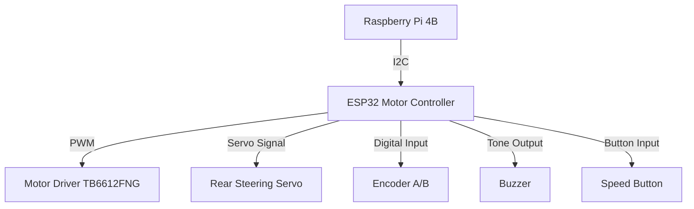

# ⚙️ ESP32 Motor + Servo + I²C Control Module  
### for WRO Future Engineers 2025 – Mindcraft Team

This directory contains the **ESP32 firmware** responsible for **low-level control** of the robot’s motor, steering, and sensors.  
It acts as an **I²C slave**, receiving commands from the **Raspberry Pi** (master) and executing them precisely in real time.

---

## 🧠 Overview

### Responsibilities
- Control **motor speed and direction** via PWM and H-bridge.
- Handle **servo steering** (rear steering mechanism).
- Measure **distance traveled** using an **incremental encoder**.
- Communicate over **I²C** with the Raspberry Pi.
- Provide **audible feedback** via a buzzer.
- Allow **manual control** with an onboard button for testing.

---

## 🧩 System Diagram




## 🧱 Hardware Pinout (GPIO Pins)

| Component / Function          | GPIO Pin |
|------------------------------|----------|
| PWB (Motor or Power Switch)  | 14       |
| BI2 (Motor Input 2)           | 12       |
| BI1 (Motor Input 1)           | 26       |
| STBY (Motor Driver Standby)   | 25       |
| SERVO PWM Signal              | 27       |
| ENCODER B Phase              | 32       |
| ENCODER A Phase              | 33       |
| PUSH BUTTON                  | 19       |
| BUZZER                      | 4        |

---

## 🔄 Communication Protocol

The ESP32 acts as an I²C slave device with address 0x08.

### Commands from Raspberry Pi → ESP32

| Command           | Description                                   | Example          |
|-------------------|-----------------------------------------------|------------------|
| M_SPEED:<value>   | Set motor speed. Positive = forward, Negative = backward | M_SPEED:80 or M_SPEED:-100 |
| M_STOP           | Immediately stop motor                         | M_STOP           |
| SERVO_ANG:<angle> | Set steering servo to a given angle (0–180°) | SERVO_ANG:105    |

### Response ESP32 → Raspberry Pi

| Response         | Description                    |
|------------------|--------------------------------|
| <encoderCount>   | Returns current encoder count (as string) |

---

## ⚙️ Motor Control

### Motor Driver Configuration

The TB6612FNG driver is controlled with:

- PWM on PIN_PWB (channel 1)
- Direction pins: PIN_BI1 and PIN_BI2
- Standby pin: PIN_STBY

### Direction Logic

| BI1  | BI2  | Motion      |
|-------|-------|-------------|
| HIGH  | LOW   | Forward     |
| LOW   | HIGH  | Reverse     |
| LOW   | LOW   | Brake / Stop|

### PWM Speed Calculation

The PWM duty cycle is set proportionally to the requested speed percentage:


$$Duty = \frac{speedPercent \times (2^{MOTOR\_LEDC\_RES} - 1)}{100}$$


For **8-bit resolution**:

$$
\text{maxDuty} = 2^8 - 1 = 255
$$

**Example:**

```cpp
speedPercent = 75; // 75%
dutyCycle = (75 * 255) / 100; // ≈ 191
```


---

## 🧮 Encoder-Based Distance Calculation

### Parameters

| Parameter              | Symbol | Value              |
|-----------------------|--------|--------------------|
| Wheel diameter        | \(D\)  | 0.065 m (65 mm)    |
| Pulses per revolution | \(P\)  | 360                |
| Circumference         | \(C\)  | \(\pi D = 0.2042\,m\) |
| Pulses per meter      | \(P_m\)| \(\frac{P}{C} \approx 1763\,\text{pulses/m}\) |

Pulses per millimeter:

$$
\text{pulsesPerMm} = \frac{\pi \times D}{P} = 5.528
$$

To move 100 mm, motor must generate:

\[
N = 100 \times 5.528 = 553\,\text{pulses}
\]

### Direction Detection (Quadrature Encoding)

```cpp
if (a == b)
encoderCount--;
else
encoderCount++;
```


- Clockwise rotation → increment
- Counter-clockwise → decrement

---

## 🧭 Servo Steering System

### Servo Calibration

| Value  | Angle | Description        |
|--------|--------|---------------------|
| 35°    | Full left  | Physical limit left  |
| 145°   | Full right | Physical limit right |
| 90°    | Center     | Neutral position     |

### Percent-to-Angle Mapping

From -100% (left) to +100% (right):

$$
\text{angle} = \text{SERVO_MIN} + \left(\frac{\text{percent} + 100}{200}\right) \times (\text{SERVO_MAX} - \text{SERVO_MIN})
$$

**Example:**

For percent = 50:

$$
\text{angle} = 35 + \frac{150}{200} \times 110 = 117.5^\circ \approx 118^\circ
$$

---

## 🔊 Buzzer Feedback System

| Tone       | Frequency (Hz) | Duration (ms) | Use            |
|------------|----------------|---------------|----------------|
| TONE_START | 1000           | 120           | Movement start |
| TONE_END   | 1500           | 120           | Movement complete |
| TONE_ERR   | 2000           | 120           | Error signal   |

Startup and shutdown sequences use melodic tones.

---

## 🔘 Button Input

Onboard button (PIN 19) is used to adjust speed manually for debugging. Each press increases speed by 25%, wrapping around after 100%.  
Debounce time:

$$
t_{debounce} = 50\,ms
$$

---

## ⚡ Quick Start

- Build with PlatformIO (in VS Code): click **PlatformIO Build** or run

```bash
platformio run
```


from the project root.

- Upload to a connected board: use **PlatformIO Upload** or run

```bash
platformio run --target upload
```


- Open serial monitor at the baud rate set in `src/main.cpp` (default 115200) to view logs and test output.

---

## ⚙️ Servo Configuration (in `src/main.cpp`)

- `servoMin`, `servoMax` — safe angular range for the servo (defaults in code: 35..145).
- `servoMid` — computed center position.
- `servoStep`, `checkDelayMs` — control sweep resolution and speed (can be tuned for smoothness).

If you want runtime control, the project can be extended with a simple Serial command parser to call

```cpp
steer(<percent>);
```


---

## 🔌 I²C Communication Example

Raspberry Pi sends:

```cpp
M_SPEED:-80
```


ESP32 executes:

- Sets motor direction to reverse.
- Converts -80 to speedPercent = 80.
- Calculates PWM duty cycle → 204/255.
- Updates motor output.
- Logs via serial:

```serial
Motor direction: Reverse, speedPercent=80
```


---

## 🧪 Testing Routines

| Function          | Description                            |
|-------------------|--------------------------------------|
| playStartupTone() | Plays startup melody                  |
| playPoweroffTone()| Plays shutdown melody                 |
| playErrorTone()   | Emits low-warning sound               |
| steer(percent)    | Converts steering percentage to servo angle |
| motorStop()       | Cuts motor PWM and disables standby  |
| handleButton()    | Adjusts speedPercent cyclically on button press |

---

## 🧰 Initialization Flow

```mermaid
flowchart TD
A[Start] --> B[Setup Pins]
B --> C[Attach Encoder Interrupts]
C --> D[Initialize Motor + Servo]
D --> E[Start I2C (Slave Mode)]
E --> F[Register I2C Handlers]
F --> G[Play Startup Melody]
G --> H[Begin Loop]
```


---

## 🪫 Power Management

`motorStandby(false)` is used to fully disable the driver. Servo and buzzer consume power only during motion or tone playback. Idle loop checks every 1 second for encoder updates to reduce overhead.

---

## 📟 Serial Output Example

```bash
Setup complete
pulsesPerMm=5.528425
Initial speedPercent=50
Servo initialized at 90° (min=35, max=145)
Ready. Use moveDistanceMm(mm) to move and steeringServo.write(angle) to steer.

Motor direction: Forward, speedPercent=75
Encoder=135
Encoder=540
Motor stopped
Buzzer tone stop
```


---

## 🧩 Summary

- Motor direction & speed via PWM
- Rear steering with percent-based mapping
- I²C slave communication with Raspberry Pi
- Encoder feedback for odometry
- Buzzer tones for events
- Manual speed testing button
- Modular code for easy integration


