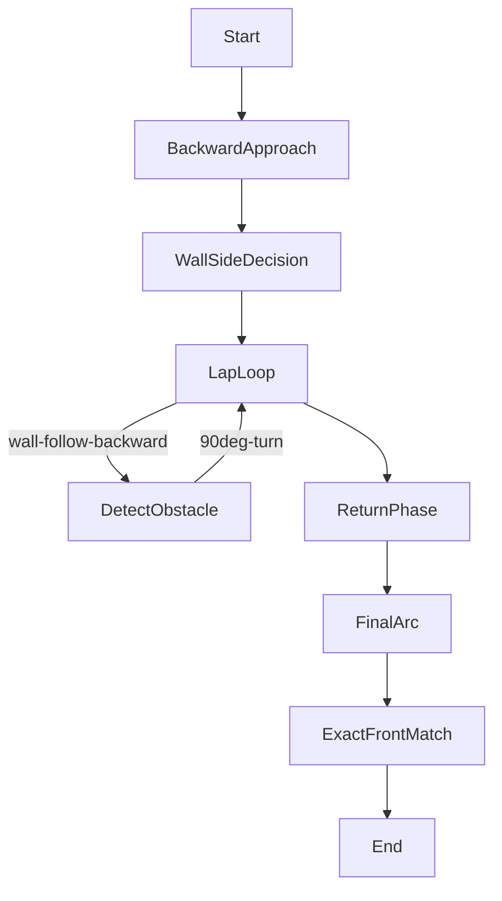

# Robot Wall-Following Lap Challenge

This README explains the strategy and implementation of a multi-lap wall-following robot challenge controlled via rear Ackermann steering, LIDAR-based navigation, and IMU feedback. The robot communicates with its ESP32 motor controller over I2C. All logic is self-contained in a single threaded C++ application. The underlying robotic task is to complete laps along a wall and return precisely to the starting position, making all decisions online based on sensor data.

---

## 🚦 **Challenge Overview**

- The robot begins facing a wall and must:
  1. **Approach the wall** backwards until a threshold distance.
  2. Decide, in real-time, whether to follow the left or right wall, based on LIDAR readings.
  3. Complete all 3 laps, each lap consisting of:
      - Wall-following (rear steering, PID control, LIDAR feedback).
      - Stopping at a front obstacle.
      - Executing a fast, accurate 90° backward arc turn.
  4. After laps, return to the starting front distance using the previously chosen wall side.

This setup tests both **navigation accuracy** and **live sensor decision-making** without a map or prior information.

---

## 📦 **Code Organization**

- **LIDAR Thread** – Receives and parses UDP packets with live LIDAR data and distributes them globally.
- **IMU & Encoder Utilities** – Poll the IMU and optionally encoders for orientation and relative motion.
- **Rear Ackermann Steering** – All maneuvering occurs via rear steering servo.
- **Main Lap Loop** – For each lap, wall-following is performed with PID control in a thread; obstacle detection halts the robot and triggers the lap turn.
- **Arc Turns** – Ultra-fast, accurate 90° backward arcs using IMU yaw feedback and rear steering.
- **Return Strategy** – At the end of laps, the robot retraces its path using median distances and wall-following, finishing with precise final distance matching.

---

## 🧭 **Navigation Strategy Deep Dive**

### 1. **Startup & Decision Logic**
- The robot starts by moving backward, measuring median distances to the front, left, and right sectors.
- It chooses the wall to follow (left or right) based on which side has greater median distance, adapting on-the-fly.

### 2. **Wall Follow (PID)**
- A PID controller continually aligns the robot's rear steering to maintain a set lateral distance to the chosen wall.
- LIDAR readings in a fixed angular sector provide robust median estimates of wall distance, filtering low-quality or outlier measurements.
- The rear Ackermann mapping smooths the steering control.

### 3. **Lap Completion**
- The robot wall-follows until the front LIDAR distance falls below a threshold for several consecutive readings.
- A thread-safe flag halts the wall-following thread, and the robot executes a 90° backward arc (IMU-based).

### 4. **Final Return**
- After laps, the robot returns to the starting position by repeating wall-following and monitoring the front distance.
- Execution is fully symmetric for left or right wall, with threshold/sector parameters swapped.

---

## ⚙️ **Core Functions Explained**

- **`followRightWallRearStableYaw` / `followLeftWallRearStableYaw`**
  - PID wall-following with LIDAR median distance as feedback
  - Maintains relative yaw stability from IMU

- **`arc90Back(direction, steerPercent)`**
  - Executes a fast 90° rear arc turn using full-speed reverse and IMU yaw feedback

- **`readLIDAR_median_cm(points, angle_min, angle_max, ...)`**
  - Filters and computes robust median distance in a given angular sector (handles outliers & noise)

- **`sendCommand(cmd)`**
  - Sends I2C commands to ESP32 motor controller for speed and steering

---

## 🖥️ **Main Loop State Diagram**



---

## 🔑 **Key Sensor Fusion Ideas**

- **Sector-Based LIDAR Filtering:** Use angles (e.g. 10-50° for right, 130-170° for left) to robustly localize the wall and avoid outliers.
- **IMU Relative Yaw:** Maintain orientation consistency during high-speed turns.
- **Threaded Wall-Following:** Allows obstacle detection logic to run asynchronously to steering control.
- **I2C Command Batching:** Ensures commands are sent smoothly to ESP32.

---

## 🛠️ **Setup Requirements**

- **Hardware:** ESP32 motor controller, BNO IMU (data in `/tmp/bno_imu.txt`), 2D LIDAR streaming via UDP, rear steering actuator.
- **Software:** Build with `g++` (Linux recommended), ensure LIDAR packets reach localhost:5005.
- **Permissions:** Needs access to `/dev/i2c-1`.

**To compile & run:**
```bash
g++ robot_lap_challenge.cpp -o robot_challenge -pthread
sudo ./robot_challenge
```

---

## 🧪 **Customization & Tuning**

- **Lap count:** Change the loop counter in `main`.
- **Wall-follow PID:** Adjust Kp/Ki/Kd and sector angles in `followLeftWallRearStableYaw`/`followRightWallRearStableYaw`.
- **Arc turn speed & percent:** Tweak `arc90Back` parameters for different steering geometries.

---

## 📟 **Example Log Output**

```
Listening on 127.0.0.1:5005
Initial distances: Fi=75, Ri=160, Li=70
Following right wall (Right=160, Left=70)

=== Lap 1 ===
[⚠️ WAIT LIDAR] Object detected at 44 cm → STOP
Arc completed

...

✅ Returned to starting position.
All 4 laps completed.
```

---

## 💡 **Open Challenge Extensions**

- Adapt to new wall shapes or obstacles.
- Integrate trajectory logging and replay.
- Use encoder + IMU fusion for even higher precision.
- Implement autonomous sector selection with learning-based heuristics.

---

## 📄 **License**

Public domain. Use this as a base for competitions, teaching, or upgrading your robot navigation stack!

