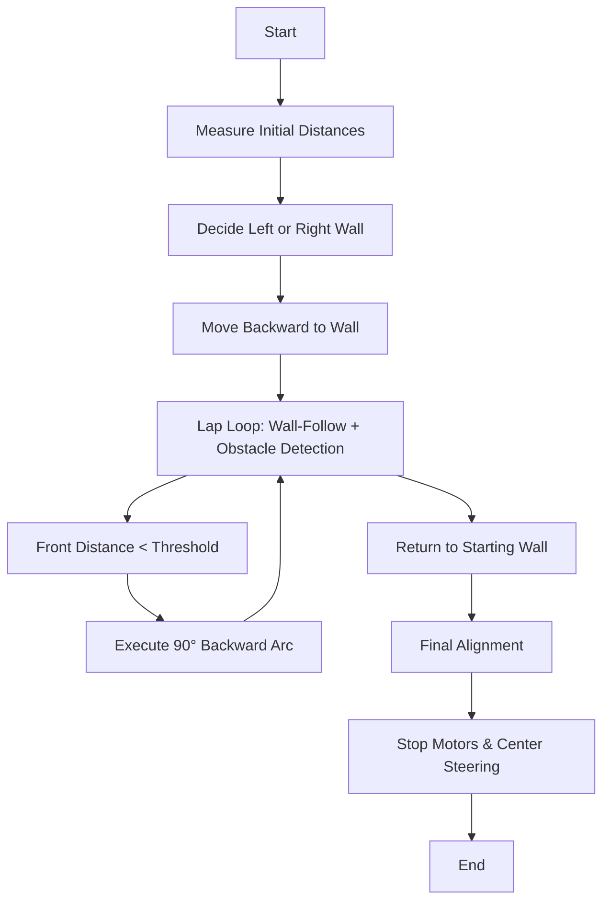

# 1. 🤖 Raspberry Pi 4B – Wall-Following Robot Controller

This README explains the **Raspberry Pi-side logic** for controlling a rear-steering, multi-lap robot challenge. The Pi integrates **LIDAR, IMU, and I²C (ESP32) communication** to make real-time navigation decisions, execute wall-following PID control, and perform precise arcs.


## Quick navigation (what I added)

- Kept the original high-level overview and math.
- Appended a detailed file-by-file reference for the entire `PI4B` folder: folders, source files, Makefiles, ports, important constants, globals, and functions with inputs/outputs.
- Added recommended small CMake snippet and build/run notes.

If you want any entry expanded into an even deeper reference (e.g., full API docstrings for every function), tell me which file and I'll expand it.


## 📌 Table of Contents — Raspberry Pi Controller

> [!TIP]
> Click the arrow below 👇 to expand the **Table of Contents**. Every item links to sections in this README.

<details>
<summary><b>📂 Table of Contents</b></summary>

1. [1. 🏁 Open Challenge](#1-🏁-open-challenge)
   - [1.1 🚦 Challenge Overview](#11-🚦-challenge-overview)
2. [2. 📦 Code Architecture](#2-📦-code-architecture)
3. [3. 🧮 Sensor Data & Math](#3-🧮-sensor-data--math)
   - [3.1 LIDAR Median Distance](#31-lidar-median-distance)
   - [3.2 Wall-Follow PID](#32-wall-follow-pid)
   - [3.3 Arc Turns](#33-arc-turns)
   - [3.4 Front Obstacle Detection](#34-front-obstacle-detection)
4. [4. 🖥️ Main Loop Flowchart](#4-🖥️-main-loop-flowchart)
5. [5. 🔑 Key Design Decisions](#5-🔑-key-design-decisions)
6. [6. 🛠️ Setup & Execution](#6-🛠️-setup--execution)
7. [7. 📟 Sample Output](#7-📟-sample-output)
8. [8. 📊 Tuning Recommendations](#8-📊-tuning-recommendations)
9. [9. 📚 References / Math Summary](#9-📚-references--math-summary)
10. [10. 🧭 PI4B Folder — Detailed File & Function Reference](#10-🧭-pi4b-folder---detailed-file--function-reference)

</details>


## 1. 🏁 Open Challenge

### 1.1 🚦 Challenge Overview

- Complete **3 laps** along a wall and return precisely to starting distance.
- **Steps:**
  1.  Move backward until a **starting threshold distance**.
  2.  Decide **which wall to follow** (left or right) using LIDAR median distances.
  3.  Perform **wall-following** using a PID controller on rear steering.
  4.  Stop at detected front obstacles and execute **90° backward arcs** (IMU-guided).
  5.  Return to **starting front distance**.


## 2. 📦 Code Architecture

- **Main Thread:** Lap logic, front LIDAR monitoring, lap counting.
- **LIDAR Receiver Thread:** Parses UDP packets and stores global `latest_points` / `latestLidar`.
- **IMU Utilities / Sender:** Produces yaw/pitch/roll, rotation deltas and cumulative rotations.
- **Wall-Follow Threads:** PID loops for left/right wall; controlled via an atomic flag (e.g., `wallFollowStop`).
- **I²C Communication:** `sendCommand()` sends speed/steering commands to ESP32 over `/dev/i2c-1`.
- **Arc Turns:** `arc90Back()` and `arc()` execute precise 90° turns using IMU feedback.


## 3. 🧮 Sensor Data & Math

### 3.1 LIDAR Median Distance

$$
d_{\\text{median}} = \\text{median}\\{ d_i \,|\, \\theta_i \\in [\\theta_\\text{min}, \\theta_\\text{max}], q_i \\ge Q_\\text{th} \\\}
$$

- Right wall: 10°–50°
- Left wall: 130°–170°
- Front: 80°–100°
- Convert mm → cm: $d_{\\text{cm}} = d_{\\text{median}} / 10$

### 3.2 Wall-Follow PID

$$
\\text{error} = d_\\text{target} - d_\\text{median}
$$

$$
\\text{correction} = K_p \\cdot \\text{error} + K_i \\int \\text{error}\\,dt + K_d \\frac{d(\\text{error})}{dt}
$$

$$
\\text{steerAngle} = \\text{clamp}(90 + \\text{correction}, 0, 180)
$$

### 3.3 Arc Turns

$$
\\text{targetYaw} = \\text{currentYaw} \\pm 90^\\circ
$$

- Loop until $| \\text{currentYaw} - \\text{targetYaw}| < 1^\\circ$ (or a small tolerance)
- Steering scaled with `steerPercent` parameter
- Speed modulation example used in code: $v\\_cmd = v\\_base - \\text{correction} / 50$

### 3.4 Front Obstacle Detection

Require **consecutive readings**: $d\\_front \\le d\\_threshold$ for `n_consecutive` (typically 3) before deciding an obstacle is present.


## 4. 🖥️ Main Loop Flowchart




## 5. 🔑 Key Design Decisions

- Threaded PID wall-following for responsive control.
- Median LIDAR filtering to remove noisy measurements.
- Atomic flags (e.g., `wallFollowStop` / `ctrl_c_pressed`) for safe inter-thread coordination.
- Adaptive wall choice based on initial median distances.
- Speed clamping to avoid stalling and to keep arcs predictable.


## 6. 🛠️ Setup & Execution (summary)

**Requirements:**

- Raspberry Pi 4B
- /dev/i2c-1 access
- UDP LIDAR stream on port 5005 (local loopback is used in several tools)
- IMU data via UDP (default 5006) or `/tmp/bno_imu.txt` (depending on the consumer)
- Connected ESP32 motor controller on I2C at address 0x08 (default in code)

**Build & Run (examples, per-subproject):**

- LIDAR sender (C++): build with the Makefile in `LIDAR_DATA_SENDER/` (produces `lidar_data`).
- I2C controller programs: build with their Makefile (e.g., `i2c_esp32` or `i2c_send`).
- Dashboard UDP receiver (visual): build using the Makefile in `DASHBOARD_UDP_RECEIVER/` (produces `dashboard`).

Example (generic):

```powershell
# From the subdirectory containing a Makefile (on Pi use a POSIX shell):
make
sudo ./<target>
```

If you prefer a single CMake-based build, see the small snippet below (optional) under the detailed section.


## 7. 📟 Sample Output

```text
Listening on 127.0.0.1:5005
Initial distances: Fi=75, Ri=160, Li=70
Following right wall (Right=160, Left=70)

=== Lap 1 ===
[⚠️ WAIT LIDAR] Object detected at 44 cm -> STOP
Arc completed

✅ Returned to starting position.
All 3 laps completed.
```


## 8. 📊 Tuning Recommendations

| Parameter        | Effect                   | Typical Value |
| ---------------- | ------------------------ | ------------: |
| Kp               | Responsiveness           |       1.5–2.5 |
| Ki               | Steady-state error       |         0–0.1 |
| Kd               | Overshoot damping        |       0.1–0.5 |
| targetDistanceCm | Lateral distance to wall |      30–40 cm |
| baseSpeedPercent | Robot speed              |        60–200 |
| steerPercent     | Arc sharpness            |        30–120 |


## 9. 📚 References / Math Summary

- LIDAR median distance
- PID correction formula
- Steering mapping
- Arc yaw calculation
- Front obstacle detection threshold


## 10. 🧭 PI4B Folder — Detailed File & Function Reference

This section explains the directory structure in `PI4B/` and documents each important file present in the repository (based on the files you provided). I describe the purpose, important constants, key globals, and the main functions with inputs/outputs and behavior.

NOTE: I didn't remove any of the earlier content — I only appended detailed documentation below. If a function exists in multiple files (e.g., `main.cpp` across subfolders), I identify them by subfolder.

### Top-level files in `PI4B/`

- `README.md` — (this file) high-level overview and the detailed reference appended here.
- `Commands.md` — A short cheat-sheet for basic Linux/RPi commands and library install commands (e.g., `python3-pip`, `rplidar`, `picamera2`). Useful for initial setup.

### Subfolders (and their highlights)

1. `LIDAR_DATA_SENDER/`

   - Purpose: connect to a physical RPLIDAR and stream raw points over UDP.
   - Main files:
     - `main.cpp` — uses the RPLIDAR SDK to grab scan nodes, normalize angles, and send textual UDP packets in format: `angle,dist,quality angle,dist,quality ... \\n`.
     - `Makefile` — builds `lidar_data` executable.
   - Key constants and behavior (from `main.cpp`):
     - Serial port: `/dev/serial0` (default); baud 460800.
     - UDP target: `127.0.0.1:5005` (standard local testing port; dashboard expects data here).
     - Angle inversion: compile-time `INVERT_ANGLES` toggles whether the stream flips angles (makes LIDAR orientation consistent with other code).
   - Output: UDP text messages with many `angle,dist_mm,quality` triplets separated by spaces. Receiver must parse them.

2. `IMU_DATA_SENDER/` (BNO055 Python streamer)

   - Purpose: read BNO055 IMU and send orientation + linear accel over UDP.
   - Main files:
     - `bno_stream.py` — Python script using `adafruit-circuitpython-bno055`. Default UDP: 127.0.0.1:5006. Sends messages like: `roll,pitch,yaw,delta,rotation_dir,total_rot,lin_x,lin_y\\n`.
     - `requirements.txt` — lists `adafruit-circuitpython-bno055`.
   - Key behavior and variables:
     - `INVERT` option: flips yaw around 180° (helper `invert_yaw_around_180`) to match other coordinate conventions.
     - Unwrapping logic: the script tracks unwrapped yaw and computes `delta` between samples; accumulates rotations and tracks `total_rot` (full 360° rotations).
     - `THRESH` parameter: yaw delta threshold (degrees) below which small jitter is ignored.
     - Useful CLI flags: `--debug`, `--invert`, `--udp-ip`, `--udp-port`, `--delay`, `--target-rotations`.
   - Output: one-line CSV per packet describing euler angles and linear acceleration.

3. `LIDAR_DATA_SENDER/` (Makefile) — described earlier; build with `make`.

4. `DASHBOARD_UDP_RECEIVER/`

   - Purpose: small C++ viewer for LIDAR and IMU streams (uses OpenCV to visualize points and robot heading).
   - Main files:
     - `main.cpp` — UDP receiver(s) and visualization.
     - `Makefile` — builds `dashboard` executable.
   - Important globals / data types from `main.cpp`:
     - `struct LidarPoint { float angle; float dist; uint8_t quality; }` — holds parsed LIDAR sample.
     - `struct ImuSample { float yaw, pitch, roll, lin_x, lin_y, delta; string rotation_dir; int total_rot; }`.
     - `std::vector<LidarPoint> latestLidar;` and `ImuSample latestImu;` protected by `std::mutex mtx;`.
     - `highlightAngles` — list of angles drawn on the display (configurable via stdin if the input thread is enabled).
   - Key functions (behavioral summary):
     - `parseLidarData(const std::string &data)` — splits the UDP text into `angle,dist,quality` tokens and returns a vector of `LidarPoint`.
     - `parseImuData(const std::string &data)` — parses IMU UDP lines into `ImuSample`.
     - `udpReceiverThread(int port, bool isLidar)` — opens a UDP socket and fills global buffers; uses a small receive timeout.
     - Drawing helpers: `drawRobotTriangle()` draws a heading triangle for visualization.
   - Usage: build with `make` in the `DASHBOARD_UDP_RECEIVER/` dir. Ensure OpenCV dev headers are available; the Makefile uses `pkg-config --cflags opencv4`.

5. `I2C_COMMUNICATION_ESP32_PI4/` (control logic + wall-follow)

   - Purpose: core robot logic — reads LIDAR via UDP, reads IMU (either UDP or file), sends motor/steer commands to ESP32 via I2C, and implements wall-following routines.
   - Main files:
     - `main.cpp` — contains the majority of the control code: LIDAR utilities, PID controllers, arc implementations, I2C functions, and the high-level lap logic.
     - `Makefile` — builds `i2c_esp32` (or `i2c_send`) using g++.
   - Key constants (from `main.cpp`):
     - `const char* I2C_BUS = "/dev/i2c-1";`
     - `const int ESP32_ADDR = 0x08;` (I2C address used to communicate with the ESP32 motor controller)
     - Default UDP LIDAR port used by sender/receiver: 5005.
     - IMU file path: `/tmp/bno_imu.txt` (some parts may rely on this file for IMU read fallback).
   - Important global variables and thread flags:
     - `std::vector<LidarPoint> latest_points;` — LIDAR data updated by background receiver.
     - `std::atomic<bool> ctrl_c_pressed(false);` — program-wide shutdown flag.
     - `std::atomic<bool> wallFollowStop(false);` — used to stop a wall-following thread when transitioning.
   - Key functions and their contract (summary):

     - `bool sendCommand(const string& cmd)`

       - Purpose: send a newline-terminated command to ESP32 over I2C.
       - Input: ASCII command string (e.g., `V:100,S:90` or whatever the ESP32 expects) — code appends `\\n`.
       - Output: returns true on write success; prints a confirmation on success.
       - Errors: opens `/dev/i2c-1`, sets slave address via `ioctl`, writes bytes, closes file.

     - `long readEncoder()`

       - Purpose: request encoder (or similar telemetry) from ESP32 via I2C. Returns measured encoder count or -1 on error.

     - `IMUData readIMUData(const string& path)`

       - Purpose: read a small text file (produced by IMU sender or aggregator) to get yaw/pitch/roll and linear acceleration.

     - `float readLIDAR_median_cm(const std::vector<LidarPoint>& points, float angle_min, float angle_max, int quality_threshold, float max_valid_mm)`

       - Purpose: filter points by angle and quality, convert to cm and return median distance.
       - Input: point vector, angle range, quality threshold, optional max valid reading.
       - Output: median distance in cm (or NaN / sentinel depending on code). Used to compute left/right/front distances.

     - `void waitLIDAR(...)`

       - Purpose: block until a desired LIDAR target distance is reached (used on approach).

     - `void arc(int direction, float baseSpeed, float degrees, float steerPercent)` and `void arc90Back(int direction, int steerPercent)`

       - Purpose: perform a yaw-based arc using IMU feedback until a target yaw is reached (direction defines left/right, sign conventions depend on code). Uses IMU yaw to stop at ±90°.
       - Inputs: direction (±1), base speed, degrees, steerPercent for sharpness.

     - `void go(int direction, int speedPercent, float Kp_steer, float maxSteerCorrection, bool invertRear)`

       - Purpose: send drive commands to ESP32 (likely speed + steering). Uses PID steering correction when following walls.

     - Wall-follow routines: `followRightWallRearStableYaw(...)`, `followLeftWallRearStableYaw(...)`
       - Purpose: continuous PID loops that measure median distances on the appropriate side and compute steering corrections to maintain `targetDistanceCm`.
       - Inputs: `targetDistanceCm`, `baseSpeedPercent`, PID terms, `maxSteerCorrection`.
       - These often run in their own thread. They check `wallFollowStop` to exit.

   - Typical runtime flow (high level):

     1. Bind UDP socket and start `lidarReceiver` thread to populate `latest_points`.
     2. Measure initial distances (front, left, right) using `readLIDAR_median_cm`.
     3. Choose which wall to follow (left or right) based on which is closer or other threshold logic.
     4. Spawn wall-follow thread for chosen side.
     5. Monitor front distance for obstacles; on detection, stop wall follow and call `arc90Back()` to perform a 90° backward arc.
     6. Count laps and return to starting position.

   - I2C protocol assumptions (ESP32): The `sendCommand()` function assumes textual commands terminated by `\\n`. The ESP32 firmware must parse that protocol and produce any telemetry on read() when requested.

6. `OPEN_CHALLENGE/` — similar to `I2C_COMMUNICATION_ESP32_PI4` but more focused on open challenge logic.
   - Contains another `main.cpp` that merges techniques: IMU, LIDAR, wall follow, and higher-level lap orchestration. The functions and constants are similar to the `I2C_COMMUNICATION_ESP32_PI4` main; refer to it for detailed semantics.
   - Where there are two versions of `main.cpp`, treat the more recent one as canonical (check commit history); the README here documents both in a single place for clarity.

### Build files and scripts

- `Makefile` (present in multiple subfolders): typically compiles a single `main.cpp` into a platform executable. Example flags in `DASHBOARD_UDP_RECEIVER/Makefile` include `-std=c++11` and `pkg-config --cflags opencv4` plus `-lpthread` and `pkg-config --libs opencv4` for linking OpenCV.

- `requirements.txt` (IMU sender): lists `adafruit-circuitpython-bno055` (install in your Python venv or system Python on RPi).

### UDP and I/O summary (ports and data formats)

- LIDAR UDP sender -> port 5005

  - Format: space-separated `angle,dist_mm,quality` triplets, newline-terminated.

- IMU UDP sender (`bno_stream.py`) -> default port 5006

  - Format (one-line CSV): `roll,pitch,yaw,delta,rotation_dir,total_rot,lin_x,lin_y\\n` (the receiving code must handle parsing and potentially fallback to `/tmp/bno_imu.txt`).

- I2C: `/dev/i2c-1` to ESP32 at address `0x08` by default (read/write semantics used in `sendCommand()` and `readEncoder()`).

### Small optional CMakeLists.txt snippet (if you prefer CMake over Makefiles)

If you'd rather use CMake, here is a tiny example for `DASHBOARD_UDP_RECEIVER`:

```cmake
cmake_minimum_required(VERSION 3.10)
project(dashboard)
find_package(PkgConfig REQUIRED)
pkg_check_modules(OPENCV4 REQUIRED opencv4)
add_executable(dashboard main.cpp)
target_include_directories(dashboard PRIVATE ${OPENCV4_INCLUDE_DIRS})
target_link_libraries(dashboard PRIVATE ${OPENCV4_LIBRARIES} pthread)
target_compile_options(dashboard PRIVATE -std=c++11 -Wall)
```

Place this snippet in the folder and run:

```powershell
mkdir build; cd build; cmake ..; cmake --build .
```

### Quick troubleshooting & tips

- If LIDAR packets aren't arriving, run the `lidar_data` executable in `LIDAR_DATA_SENDER/` with `--debug` to see what it's sending.
- If IMU yaw seems inverted relative to your map, use the `--invert` flag in `bno_stream.py` or apply the `invert_yaw_around_180` helper.
- Confirm ESP32 I2C address and permissions: the process needs permission to open `/dev/i2c-1` (run under a user in `i2c` group or with sudo for quick tests).
- OpenCV dashboard requires dev headers and `pkg-config` to find them (install `libopencv-dev` on Debian/Ubuntu).

### What I did in this update

- Preserved original high-level README content.
- Appended a detailed file-by-file and function-level reference for all `PI4B` subfolders and key files (LIDAR sender, IMU sender, Dashboard, I2C control, Open Challenge).
- Added UDP / I2C port summary and a small optional CMake example.

If you'd like, next steps I can take for you:

1. Expand any single source file into a function-by-function doc (with parameter types and example command strings).
2. Create CMakeLists for every subfolder so you can build the entire PI4B tree with a single top-level CMake.
3. Add simple unit tests or a run script that launches the IMU and LIDAR senders and the dashboard for local debugging.

Tell me which next step you want and I'll implement it.


