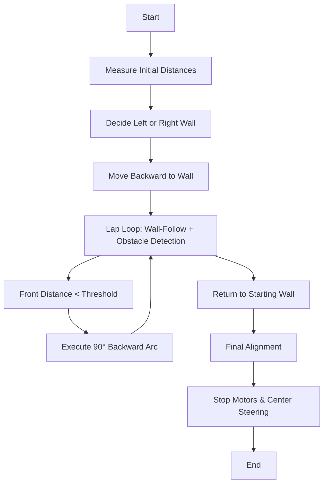

# 🤖 Raspberry Pi 4B – Wall-Following Robot Controller

This README explains the **Raspberry Pi-side logic** for controlling a rear-steering, multi-lap robot challenge.  
The Pi integrates **LIDAR, IMU, and serial/I²C communication** to make **real-time navigation decisions**, execute wall-following PID control, and perform precise arcs.


## 🏁 **Open Challenge**

### 🚦 Challenge Overview

- Complete **3 laps** along a wall and return precisely to starting distance.
- **Steps:**
  1. Move backward until a **starting threshold distance**.
  2. Decide **which wall to follow** (left or right) using LIDAR median distances.
  3. Perform **wall-following** using a PID controller on rear steering.
  4. Stop at detected front obstacles and execute **90° backward arcs** (IMU-guided).
  5. Return to **starting front distance**.


### 📦 Code Architecture

- **Main Thread:** Lap logic, front LIDAR monitoring, lap counting.
- **LIDAR Receiver Thread:** Parses UDP packets and stores global `latest_points`.
- **IMU Utilities:** Yaw/pitch/roll reading for arcs.
- **Wall-Follow Threads:** PID loops for left/right wall; controlled via `wallFollowStop` atomic flag.
- **I²C Communication:** `sendCommand()` sends speed/steering commands to ESP32.
- **Arc Turns:** `arc90Back()` executes precise 90° turns using IMU feedback.


### 🧮 Sensor Data & Math

#### 1. LIDAR Median Distance
$$
d_{\text{median}} = \text{median}\{ d_i \,|\, \theta_i \in [\theta_\text{min}, \theta_\text{max}], q_i \ge Q_\text{th} \}
$$

- Right wall: 10°–50°  
- Left wall: 130°–170°  
- Front: 80°–100°  
- Convert mm → cm: $d_{\text{cm}} = d_{\text{median}} / 10$

#### 2. Wall-Follow PID
$$
\text{error} = d_\text{target} - d_\text{median}
$$

$$
\text{correction} = K_p \cdot \text{error} + K_i \int \text{error}\,dt + K_d \frac{d(\text{error})}{dt}
$$

$$
\text{steerAngle} = \text{clamp}(90 + \text{correction}, 0, 180)
$$

#### 3. Arc Turns
$$
\text{targetYaw} = \text{currentYaw} \pm 90^\circ
$$

- Loop until $| \text{currentYaw} - \text{targetYaw}| < 1^\circ$
- Steering scaled with `steerPercent`
- Speed modulation:
$v\_cmd = v\_base - \text{correction} / 50$


#### 4. Front Obstacle Detection
Require **consecutive readings**:
$d\_front \le d\_threshold \text{ for } n\_consecutive = 3$


### 🖥️ Main Loop Flowchart




## 🔑 Key Design Decisions

- Threaded PID wall-following for fast response  
- Median LIDAR filtering removes noise  
- Atomic flags ensure thread-safe communication  
- Adaptive wall choice based on initial median distances  
- Speed clamping to prevent stalling or overshoot  


## 🛠️ Setup & Execution

**Requirements:**

- Raspberry Pi 4B  
- /dev/i2c-1 access  
- UDP LIDAR stream on port 5005  
- IMU data file: /tmp/bno_imu.txt  
- Connected ESP32 motor controller  

**Build & Run:**

```bash
g++ main.cpp -o i2c_send -pthread
sudo ./i2c_send
```


## 📟 Sample Output

```bash
Listening on 127.0.0.1:5005
Initial distances: Fi=75, Ri=160, Li=70
Following right wall (Right=160, Left=70)

=== Lap 1 ===
[⚠️ WAIT LIDAR] Object detected at 44 cm → STOP
Arc completed

✅ Returned to starting position.
All 4 laps completed.
```


## 📊 Tuning Recommendations

| Parameter         | Effect              | Typical Value       |
|-------------------|---------------------|---------------------|
| Kp                | Responsiveness      | 1.5–2.5             |
| Ki                | Steady-state error  | 0–0.1               |
| Kd                | Overshoot damping   | 0.1–0.5             |
| targetDistanceCm   | Lateral distance to wall | 30–40 cm         |
| baseSpeedPercent   | Robot speed         | 60–200              |
| steerPercent      | Arc sharpness       | 30–120              |


## 📚 References / Math Summary

- LIDAR median distance  
- PID correction formula  
- Steering mapping  
- Arc yaw calculation  
- Front obstacle detection threshold  


## 🏗️ Obstacle Challenge

