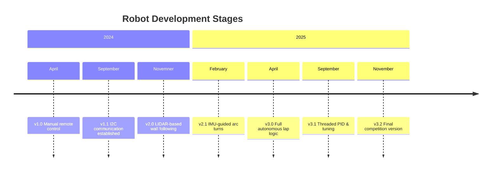
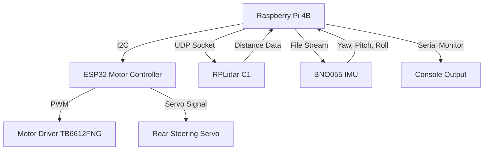
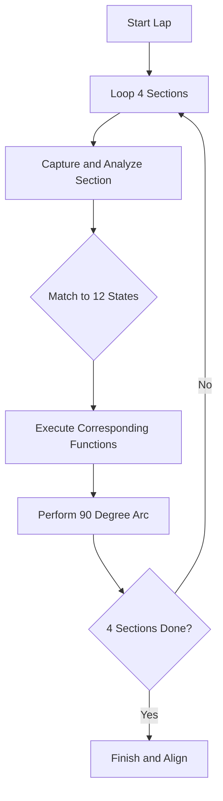
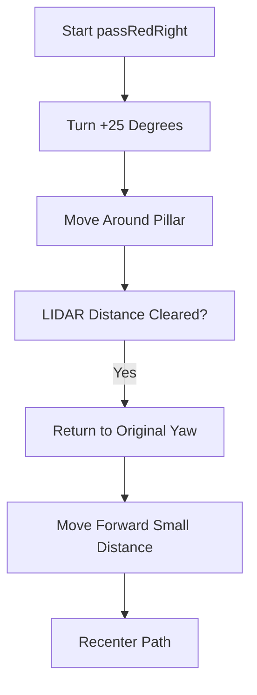
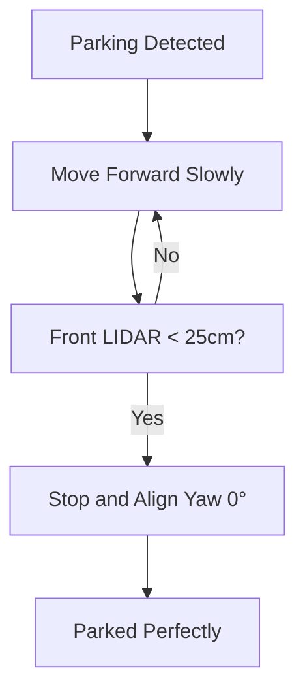
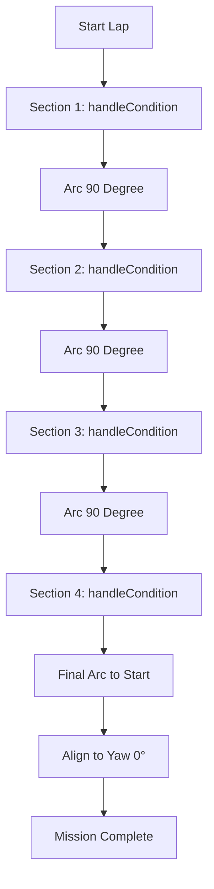

# 1. 🤖 WRO Future Engineers 2025
### **Mindcraft Team – Autonomous Robot Source Code**

Welcome to the `src/` directory of our robot codebase!  
Here you'll find all the **core control systems** powering our autonomous robot for WRO Future Engineers, blending **Raspberry Pi intelligence**, **ESP32 motion control**, and robust **LIDAR-IMU navigation**.


## 📌 Table of Contents — Mindcraft Source Tree

> [!TIP]
> Click the arrow below 👇 to expand the **Table of Contents**.  
> Every item is a clickable link to a section in this README.

<details>
<summary><b>📂 Table of Contents</b></summary>

1. [1. 🤖 WRO Future Engineers 2025](#1-🤖-wro-future-engineers-2025)  
2. [2. 📂 Directory Overview](#2-📂-directory-overview)  
3. [3. 🔄 Iterative Development Timeline](#3-🔄-iterative-development-timeline)  
   - [3.1 🧱 Iteration Timeline](#31-🧱-iteration-timeline)  
4. [4. 🧠 System Architecture](#4-🧠-system-architecture)  
5. [5. 🧩 Communication Protocols](#5-🧩-communication-protocols)  
6. [6. 🚀 Open Challenge Strategy](#6-🚀-open-challenge-strategy)  
   - [6.1 Mission Flow](#61-mission-flow)  
   - [6.2 Control Logic and Threads](#62-control-logic-and-threads)  
   - [6.3 Raspberry Pi Thread Map](#63-raspberry-pi-thread-map)  
   - [6.4 PID Tuning Table](#64-pid-tuning-table)  
7. [7. 🛡️ Safety & Robustness Features](#7-🛡️-safety--robustness-features)  
8. [8. 📊 Typical Console Output](#8-📊-typical-console-output)  
9. [9. 🏅 Summary](#9-🏅-summary)  
10. [10. 🚦 Obstacle Challenge](#10-🚦-obstacle-challenge)

</details>


## 2. 📂 Directory Overview

```
src ( source code )/
├── PI4B/         # High-level control, navigation, sensor fusion (C++)
└── ESP32/        # Low-level motor, servo, encoder control (C++/Arduino)
```


## 3. 🔄 Iterative Development Timeline

We improved our robot across **five key versions**, learning and tuning at each stage:

## 3.1 🧱 Iteration Timeline

| Version | Focus | Key Features | Problems Solved |
|----------|--------|---------------|------------------|
| **v1.0** | Manual Control Prototype | Pi sends basic serial commands to ESP32 for forward/backward/stop control. | Established initial communication between Raspberry Pi and ESP32. |
| **v2.0** | I²C Motor Control | Reliable I²C protocol for motor & servo, encoder feedback support. | Eliminated unstable UART latency and inconsistent motor timing. |
| **v3.0** | LIDAR Wall-Following | Implemented real-time distance scanning and sector filtering. | Robot could now follow a wall autonomously using LIDAR data. |
| **v4.0** | IMU-Supported Arc Turns | Added BNO055 yaw feedback for precise 90° arcs and turning. | Solved drift issues in corner turns and improved orientation accuracy. |
| **v5.0** | Autonomous Multi-Lap Mission | Completed 3 autonomous laps with wall-follow + turn logic. | Solved navigation loop errors and added lap counting & recovery. |
| **v6.0** | Multithreaded Stability | Introduced threading for LIDAR, control loops, and IMU updates. | Fixed frame delays, improved real-time responsiveness and PID consistency. |
| **v7.0 (Final)** | Competition-Ready System | Tuned PID, safe threading, stop logic, 3-lap + return mission. | Solved oscillation, steering jitter, and ensured smooth lap transitions. |

### **Visual Summary of Iteration**



## 4. 🧠 System Architecture



**Hardware Roles:**
| Component            | Function                                    |
|----------------------|---------------------------------------------|
| Raspberry Pi 4B      | Runs navigation & wall-following algorithms |
| ESP32                | Motor, servo, encoder control via I2C       |
| RPLidar C1           | 360° scans, wall & obstacle sensing         |
| BNO055 IMU           | Precise yaw for accurate arc turns          |
| Rear Ackermann Servo | Steering (rear)                             |
| Motor Driver         | Dual DC motor control                       |
| I2C Bus (400 kHz)    | Pi ⇄ ESP32 comms                            |
| UDP Socket           | Real-time LIDAR data to Pi                  |


## 5. 🧩 Communication Protocols

### 5.1 🛰️ Raspberry Pi ↔ ESP32 (I²C)
| Command         | Description                          | Example         |
|-----------------|--------------------------------------|-----------------|
| M_SPEED:<val>   | Motor speed (-255..+255)             | M_SPEED:-200    |
| SERVO_ANG:<ang> | Rear steering servo (0–180°)         | SERVO_ANG:105   |
| M_STOP          | Stop all motors                      | M_STOP          |
| ENC:<val>       | Encoder feedback (ESP32→Pi)          | ENC:15324       |

### 5.2 🔌 Connections
```
Raspberry Pi 4B
│
├── I²C SDA/SCL  ───────────────>  ESP32 (motor & servo)
├── UDP Socket   <──────────────  RPLidar Data Sender
└── /tmp/bno_imu.txt <─────────  BNO055 (Python script)
```


## 6. 🚀 Open Challenge Strategy

The robot autonomously performs **3 laps** around the arena, using only LIDAR and IMU data (no cameras).  
Rear Ackermann steering allows tight, precise 90° arc turns at corners, guided by IMU yaw readings.

### 6.1 Mission Flow


### 6.2 Control Logic and Threads

#### PID Wall-Following (Left/Right)
```cpp
error = targetDistance - measuredDistance;
integral += error * dt;
derivative = (error - prevError) / dt;
output = Kp * error + Ki * integral + Kd * derivative;
steerAngle = clamp(90 + output, 0, 180);
```
- Runs in a separate thread: `followLeftWallRearStableYaw` or `followRightWallRearStableYaw`
- Maintains ~30 cm from wall using LIDAR median filter in sector.
- Limits servo angle for rear steering.
- PID tuned for stable, smooth tracking.

#### 🌀 90° Arc Turns
- `arc90Back(direction, steerPercent)` executes fast 90° backward arcs.
- Robot steers rear wheels with fixed angle, moves backward, tracking IMU yaw.
- Stops once 90° yaw delta is reached.

##### **Direction:**
- **1** = left arc
- **-1** = right arc

#### 6.3 🧭 LIDAR Sectors
| Sector | Angle Range (°)   | Function                  |
|--------|-------------------|---------------------------|
| Front  | 80–100            | Obstacle/Finish detection |
| Left   | 130–170           | Left wall-follow          |
| Right  | 10–50             | Right wall-follow         |


### 6.3 Raspberry Pi Thread Map

| Thread                 | Role                                       |
|------------------------|--------------------------------------------|
| Main Thread            | Runs mission, lap loop                     |
| LIDAR Receiver         | UDP data, updates point cloud              |
| Wall-Follow Thread     | PID wall-alignment (starts & stops laps)   |
| IMU Writer (external)  | Updates `/tmp/bno_imu.txt` from Python     |


### 6.4 ⚙️ PID Tuning Table

| Mode           | Kp  | Ki  | Kd   | Description          |
|----------------|-----|-----|------|----------------------|
| Wall-follow    | 2.0 | 0.0 | 0.5  | Stable wall distance |
| Arc rotation   | 2.0 | 0.0 | 0.1  | Smooth turns         |
| Yaw correction | 0.3 | 0.0 | 0.0  | Direction stability  |


## 7. 🛡️ Safety & Robustness Features

- **Ctrl+C interrupt** → Safely stops threads & motors  
- **Median filtering** → Filters noisy LIDAR data  
- **Steering limits** → Servo angles clamped 0–180°  
- **Timeout checks** → Prevent stuck motion  
- **Thread control flags** → Reliable lap termination


## 8. 📊 Typical Console Output

```
Listening on 127.0.0.1:5005
Initial distances: Fi=72, Ri=29, Li=35
Following left wall (Right=29, Left=35)

=== Lap 1 ===
[PID] Left wall: target=30 | current=31.2 | servo=94
[⚠️ WAIT LIDAR] Object detected at 55 cm → STOP
Performing 90° backward arc LEFT...
Lap 1 complete.
```


## 9. 🏅 Summary

✅ Autonomous wall-following  
✅ Rear Ackermann steering  
✅ IMU-guided 90° arc turns  
✅ Multi-threaded PID control  
✅ LIDAR-only navigation  
✅ Automatic 3-lap completion & return


# 10. 🚦 Obstacle Challenge

This section explains **how the robot integrates its camera, LIDAR, and control logic** to handle obstacles and parking in a fully autonomous lap.

---


## 🎥 Camera and LIDAR Integration

The onboard **camera** continuously captures frames that are analyzed using **OpenCV**.  
Each frame is processed to detect **colored obstacles (Red / Green)** based on HSV filtering:

```cpp
// Pseudocode Example
frame = camera.read()
mask_red = hsvInRange(frame, lower_red, upper_red)
mask_green = hsvInRange(frame, lower_green, upper_green)

if detectObstacle(mask_red, mask_green):
    colorState = getColorState(mask_red, mask_green)

```

Meanwhile, the LIDAR measures distances to surrounding objects and walls.
It provides depth data that ensures obstacle avoidance and alignment:

```cpp
// Simplified LIDAR check
frontDist = lidar.getFrontDistance()
leftDist = lidar.getLeftDistance()
rightDist = lidar.getRightDistance()
```

Both sensors feed into a state decision system, which determines how the robot must react.

## 🧠 State Machine and Function Calls

Each camera frame is classified into a color state:

🔴 Red on Left
🟢 Green on Right
🅿️ Parking zone detected
Or empty segment (no obstacle)

The control loop calls the corresponding function for each detected case:

```cpp
if state == "Red":
    passRedRight()
elif state == "Green":
    passGreenLeft()
elif state == "Parking":
    handleParking()
else:
    wallFollow()
```

##🧭 Main Section Flow

The robot performs 4 sections (laps) in a loop.
Each section begins with image detection, state classification, function execution, and ends with a 90° arc.



##🔴 Passing a Red Obstacle (Right Side)
This function ensures the robot moves around a red pillar from the right side using LIDAR and gyro feedback.

```cpp
void passRedRight() {
    turn(+25);
    moveForwardUntilClear();
    realignYaw();
    moveForwardSmall();
}
```


##🟢 Passing a Green Obstacle (Left Side)
Same logic but mirrored to the left side.

```cpp
void passGreenLeft() {
    turn(-25);
    moveForwardUntilClear();
    realignYaw();
    moveForwardSmall();
}
```

##🅿️ Parking Zone Detection

When the camera detects a parking color pattern (usually both red and green close to the front),
the robot activates the `handleParking()` routine.
LIDAR ensures the robot stops exactly at the correct distance (e.g., 25 cm from the wall).

```cpp
void handleParking() {
    while (lidar.front() > 25) {
        moveForwardSlow();
    }
    stopMotors();
    alignYaw(0);
}
```



###🔄 Full Lap Sequence
The robot completes four 90° turns to return to its starting orientation.
Each section includes detection, decision, and movement.



| Component        | Role                               | Key Function              |
| ---------------- | ---------------------------------- | ------------------------- |
| Camera           | Detects color of obstacles         | `getColorState()`         |
| LIDAR            | Measures distance to objects/walls | `getFrontDistance()`      |
| IMU (Gyroscope)  | Maintains heading                  | `alignYaw()`              |
| Motor Controller | Moves robot according to decision  | `moveForward()`, `turn()` |

##🧩 Example Control Loop (Simplified C++)
```cpp
while (running) {
    captureFrame();
    detectColors();
    updateLidar();

    if (inParkingZone()) handleParking();
    else if (redDetected()) passRedRight();
    else if (greenDetected()) passGreenLeft();
    else wallFollow();

    delay(50); // Control loop delay
}
```


