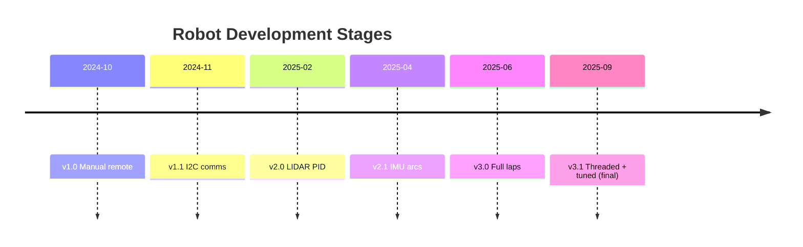
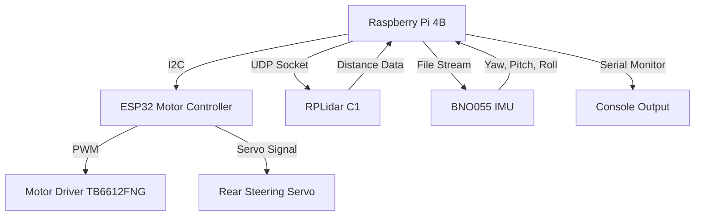
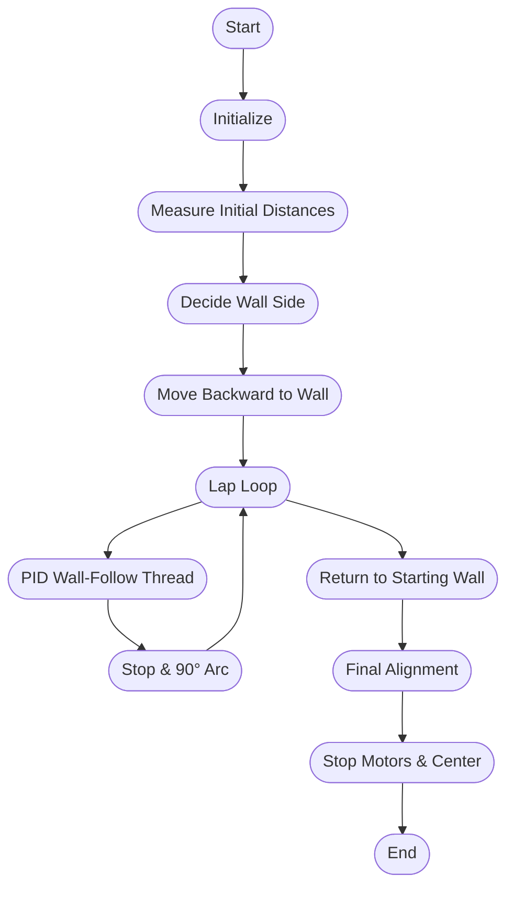

# 🤖 WRO Future Engineers 2025 – Open Challenge  
### **Mindcraft Team – Autonomous Robot Source Code**

Welcome to the `src/` directory of our **Open Challenge 2025** robot codebase!  
Here you'll find all the **core control systems** powering our autonomous robot for WRO Future Engineers, blending **Raspberry Pi intelligence**, **ESP32 motion control**, and robust **LIDAR-IMU navigation**.

---

## 📂 Directory Overview

```
src ( source code )/
├── PI4B/         # High-level control, navigation, sensor fusion (C++)
└── ESP32/                  # Low-level motor, servo, encoder control (C++/Arduino)
```

---


## 🔄 Iterative Development Timeline

We improved our robot across **five key versions**, learning and tuning at each stage:

| Version   | Focus                        | Key Features                                      |
|-----------|----------------------------- |---------------------------------------------------|
| **v1.0**  | Manual control               | Pi sends basic serial commands to ESP32            |
| **v1.1**  | Reliable I²C motor protocol  | Smooth motor & servo control, encoder feedback     |
| **v2.0**  | LIDAR wall-following         | Introduced real-time navigation, sector filtering  |
| **v2.1**  | IMU-supported arc turns      | BNO055 yaw for sharp, accurate corner maneuvers    |
| **v3.0**  | Autonomous multi-lap mission | 3 laps + return, on-the-fly wall selection         |
| **v3.1**  | Stability & multithreading   | Stable PID, robust threading, safe lap handling    |

### **Visual Summary of Iteration**



---

## 🧠 System Architecture



**Hardware Roles:**
| Component            | Function                                    |
|----------------------|---------------------------------------------|
| Raspberry Pi 4B      | Runs navigation & wall-following algorithms |
| ESP32                | Motor, servo, encoder control via I2C       |
| RPLidar C1           | 360° scans, wall & obstacle sensing         |
| BNO055 IMU           | Precise yaw for accurate arc turns          |
| Rear Ackermann Servo | Steering (rear)                             |
| Motor Driver         | Dual DC motor control                       |
| I2C Bus (400 kHz)    | Pi ⇄ ESP32 comms                            |
| UDP Socket           | Real-time LIDAR data to Pi                  |

---

## 🧩 Communication Protocols

### 🛰️ Raspberry Pi ↔ ESP32 (I²C)
| Command         | Description                          | Example         |
|-----------------|--------------------------------------|-----------------|
| M_SPEED:<val>   | Motor speed (-255..+255)             | M_SPEED:-200    |
| SERVO_ANG:<ang> | Rear steering servo (0–180°)         | SERVO_ANG:105   |
| M_STOP          | Stop all motors                      | M_STOP          |
| ENC:<val>       | Encoder feedback (ESP32→Pi)          | ENC:15324       |

### 🔌 Connections
```
Raspberry Pi 4B
│
├── I²C SDA/SCL  ───────────────>  ESP32 (motor & servo)
├── UDP Socket   <──────────────  RPLidar Data Sender
└── /tmp/bno_imu.txt <─────────  BNO055 (Python script)
```

---

## 🚀 Navigation Strategy

The robot autonomously performs **3 laps** around the arena, using only LIDAR and IMU data (no cameras).  
Rear Ackermann steering allows tight, precise 90° arc turns at corners, guided by IMU yaw readings.

### **Mission Flow**


---

## 🧮 Control Logic and Threads

### PID Wall-Following (Left/Right)
```cpp
error = targetDistance - measuredDistance;
integral += error * dt;
derivative = (error - prevError) / dt;
output = Kp * error + Ki * integral + Kd * derivative;
steerAngle = clamp(90 + output, 0, 180);
```
- Runs in a separate thread: `followLeftWallRearStableYaw` or `followRightWallRearStableYaw`
- Maintains ~30 cm from wall using LIDAR median filter in sector.
- Limits servo angle for rear steering.
- PID tuned for stable, smooth tracking.

### 🌀 90° Arc Turns
- `arc90Back(direction, steerPercent)` executes fast 90° backward arcs.
- Robot steers rear wheels with fixed angle, moves backward, tracking IMU yaw.
- Stops once 90° yaw delta is reached.

#### **Direction:**
- **1** = left arc
- **-1** = right arc

### 🧭 LIDAR Sectors
| Sector | Angle Range (°)   | Function                  |
|--------|-------------------|---------------------------|
| Front  | 80–100            | Obstacle/Finish detection |
| Left   | 130–170           | Left wall-follow          |
| Right  | 10–50             | Right wall-follow         |

---

## 🧵 Raspberry Pi Thread Map

| Thread                 | Role                                       |
|------------------------|--------------------------------------------|
| Main Thread            | Runs mission, lap loop                     |
| LIDAR Receiver         | UDP data, updates point cloud              |
| Wall-Follow Thread     | PID wall-alignment (starts & stops laps)   |
| IMU Writer (external)  | Updates `/tmp/bno_imu.txt` from Python     |

---


## ⚙️ PID Tuning Table

| Mode           | Kp  | Ki  | Kd   | Description          |
|----------------|-----|-----|------|----------------------|
| Wall-follow    | 2.0 | 0.0 | 0.5  | Stable wall distance |
| Arc rotation   | 2.0 | 0.0 | 0.1  | Smooth turns         |
| Yaw correction | 0.3 | 0.0 | 0.0  | Direction stability  |

---

## 🛡️ Safety & Robustness Features

- **Ctrl+C interrupt** → Safely stops threads & motors
- **Median filtering** → Filters noisy LIDAR data
- **Steering limits** → Servo angles clamped 0–180°
- **Timeout checks** → Prevent stuck motion
- **Thread control flags** → Reliable lap termination

---

## 📊 Typical Console Output

```
Listening on 127.0.0.1:5005
Initial distances: Fi=72, Ri=29, Li=35
Following left wall (Right=29, Left=35)

=== Lap 1 ===
[PID] Left wall: target=30 | current=31.2 | servo=94
[⚠️ WAIT LIDAR] Object detected at 55 cm → STOP
Performing 90° backward arc LEFT...
Lap 1 complete.
```

---

## 🏅 Summary

✅ Autonomous wall-following  
✅ Rear Ackermann steering  
✅ IMU-guided 90° arc turns  
✅ Multi-threaded PID control  
✅ LIDAR-only navigation  
✅ Automatic 3-lap completion & return
